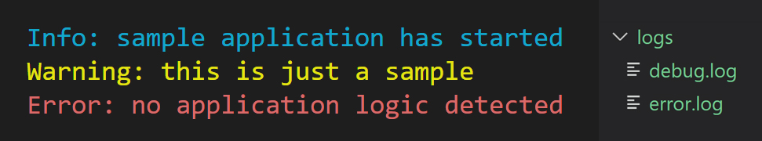
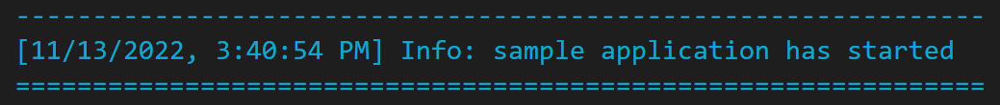
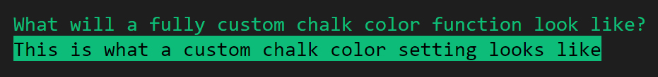

<h1 align="center">
	<br>
	<br>
	
	<br>
	<br>
	<br>
</h1>

> Simplified logging for node applications



<br>

---

<div align="center">
	<p>
		<p>
			<sup>
			  If this or any of our other projects are useful to you, please consider becoming a <a href="https://github.com/sponsors/abofs">GitHub Sponsor</a>
			</sup>
		</p>
	</p>
</div>

---

<br>

## Highlights

- Fully configurable
- Simple and Expressive API
- Highly performant

## Install

```sh
npm install @abofs/chronicle
```

## Usage

```js
import chronicle from 'chronicle';

console.log(chalk.blue('Hello world!'));
```

Chalk comes with an easy to use composable API where you just chain and nest the styles you want.

```js
import Chronicle from 'chronicle';

const chronicle = new Chronicle();

chronicle.info('Info: sample application has started');
chronicle.warn('Warning: this is just a sample');
chronicle.error('Error: no application logic detected', true); // logs to logs/error.lgo file
```

Easily define your own logging mechanism and color-coding preference:

```js
import Chronicle from 'chronicle';

const chronicle = new Chronicle({
  systemLogs: {
    blue: '#007cae', // indigo blue
    yellow: '#ae8f00', // bright orange
    red: 'red',
  },
});

chronicle.blue('Info: using custom method blue, sample application has started');
chronicle.yellow('Warning: using custom method yellow, this is just a sample');
chronicle.red('Error: using custom method red, no application logic detected', false);
```

Customize logging options to best suit your project

```js
import Chronicle from 'chronicle';

const chronicle = new Chronicle({
  logToFileByDefault: true,
  logTimestamp: true,
  path: 'custom-logs', // <project root>/custom-logs/*.log
  prefix: '--------------------------------------------------------------- \n',
  suffix: '\n=============================================================== \n',
});

chronicle.info('Info: sample application has started');
```



Add additional log types extending the default options of "info", "warn", "error" and "debug"

```js
import Chronicle from '../source/index.js';

const chronicle = new Chronicle({ additionalLogs: { question: 'green' } });

// create additional log with advanced direct chalk configuration
chronicle.setColorForType('query', chronicle.chalk().black.bgGreen);

chronicle.question('What will a fully custom chalk color function look like?');
chronicle.query('This is what a custom chalk color setting looks like');
```


## API

### defining logs and colors

By default, chronicle is instantiated with the following options:

```js
  additionalLogs: {},
  systemLogs: {
    info: 'cyan',
    warn: 'yellow',
    error: 'red',
  },
```

You can add to a new log/color setting by passing the `additionalLogs` option to the **Chronicle** constructor. Any setting that already exists in `systemLogs` will be replaced, otherwise they will be added.
 
```js
  const chronicle = new Chronicle({ additionalLogs: { info: 'green', custom: 'cyan' } });

  // output configuration:
  {
    info: 'green',
    warn: 'yellow',
    error: 'red',
    custom: 'cyan'
  }
```

Chronicle will generate convenience methods for all keys provided, with the corresponding color settings. The example above would create the following convenience methods, for logging:

####chronicle.info()
####chronicle.warn()
####chronicle.error()
####chronicle.custom()

These methods can then be called in your application with [logging parameters](https://github.com/abofs/chronicle#logging parameters).

Color settings are handled by determining whether your input is a color name, or a hex value (prefixed with **#**). For example, passing `red` as a color setting, will utilize `chalk.red`, while passing `#ff0000` would use `chalk.hex('#ff0000')` instead. A [list of available colors](https://github.com/chalk/chalk#colors) can be found in chalks' documentation. 

**IMPORTANT**: Please note that although chronicle can be configured to any color through chalk, your output is subject to your terminal's color limitations.

### advanced color setting

Sometimes you may want to do more than just pick a basic color for your output. **chalk** offers a variety of different options, and can be configured via `setColorForType()`. **Chronicle** exposes the chalk instance via `chalk()` so that you don't have to import directly into your project. Here is an example of how you can use this method to fully customize your log color setting:

```js
const chronicle = new Chronicle();

chronicle.setColorForType('info', chronicle.chalk().black.bgCyan);
chronicle.info('This log now has a cyan background');
```

`setColorForType()` can also be used as an alternative to populating the `additionalLogs` setting in the constructor, as if the setting doesn't already exist, it will then be created.

```js
const chronicle = new Chronicle();

chronicle.setColorForType('critical', chronicle.chalk().bold.red);
chronicle.critical('This is a critical error');
```

### logging parameters

```js
chronicle.error('error message', true, false); // content, logToFile, overwrite
```

| Parameter | Description |
| :---: | :--- |
| `content` | **String** Content of log that will output on your console |
| `logToFile` | **Boolean** Option to log content to file. *Default: false* |
| `overwrite` | **Boolean** Option to overwrite log file, rather than append to it. This option is redundant if logToFile is false. *Default: false* (for all log types except debug) |

**logToFile** will log to *<project-root>/logs* unless [configured differently](https://github.com/abofs/chronicle#configuration) during instantiation. 

### configuration

When instantiating **chronicle**, you can pass an object to customize your settings. Below is the default configuration:

```js
const chronicle = new Chronicle({
  logToFileByDefault: false,
  logTimestamp: false,
  path: 'logs/',
  prefix: '',
  suffix: '',
  additionalLogs: {},
  systemLogs: {
    info: 'cyan',
    warn: 'yellow',
    error: 'red',
  }
});
```

| Option | Description |
| :---: | :--- |
| `logToFileByDefault` | **Boolean** Option to change default setting for `logToFile` parameter of logging functions. *Default: false* |
| `logTimestamp` | **Boolean** Option to include timestamp in console logging. Timestamps are automatically included in file logs. *Default: false* |
| `path` | **String** Path in which to store log files. This setting is relative to your project's root directory. *Default: 'logs/*' |
| `prefix` | **String** Prefix string to prepend all log messages for all log types with the exception of *debug*. *Default: ''* |
| `suffix` | **String** Suffix string to tack on to all log messages for all log types with the exception of *debug*. *Default: ''* |
| `additionalLogs` | **Object** Key value pair object containing log type to color setting for logs that will be merged with `systemLogs` |
| `systemLogs` | **Object** Key value pair object containing log type to color setting for main chronicle logs available in application |

`additionalLogs` and `systemLogs` are explained with more detail in the [defining logs](https://github.com/abofs/chronicle#defining logs) and colors section.

## Origin

As an team of developers who are constantly working on side projects, We often litter our codebase with TODOs to refactor convenience utils such as **chronicle** into classes of their own, or projects of their own. This usually turns into internal tech debt that never gets addressed. Furthermore, We also often find ourselves going the *copy -> paste -> modify* route of previously written useful logic, which saves us time in new projects, but not as much as it would if all we had to do was run an `npm install` instead. 

With that in mind, We are proud to release **chronicle** as an open source package, in hopes others will find this just as useful as we do in their own projects.  

## Maintainers

- [Stone Costa](https://github.com/mstonepc)
- [Daniel DeLima](https://github.com/danieldtech)